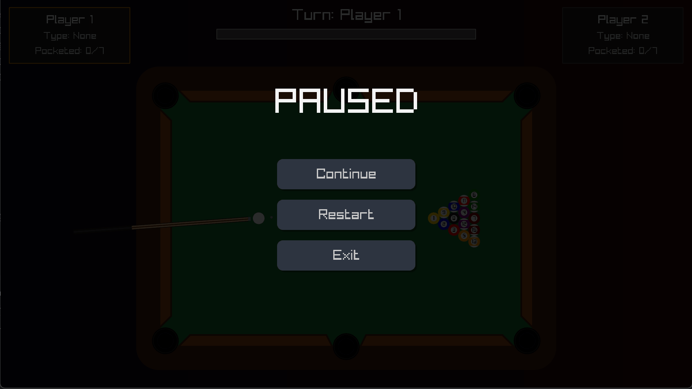
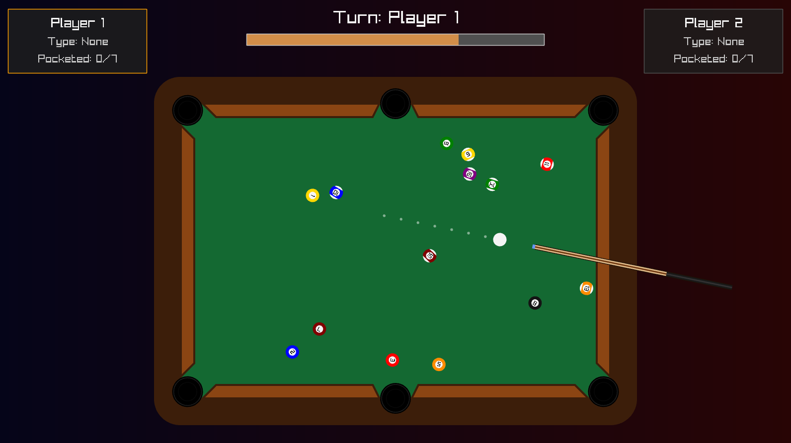
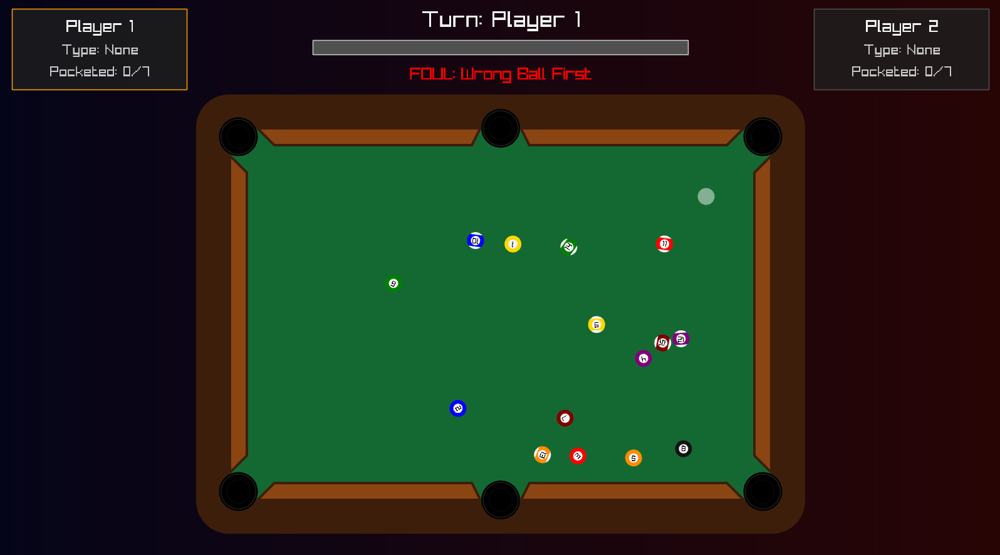
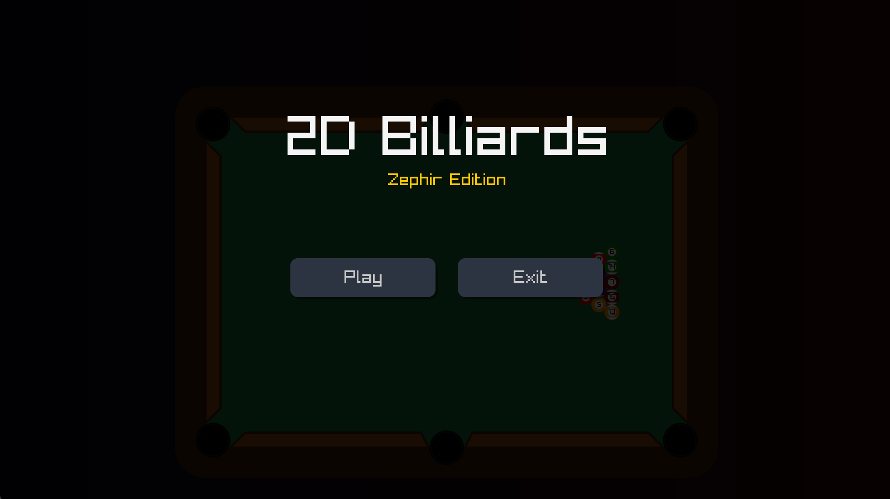
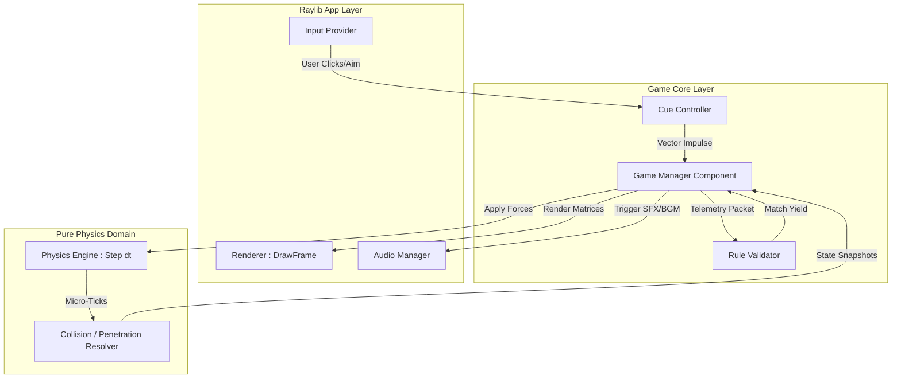

<div align="center">

# 🎱 2D Billiards

[](https://dotnet.microsoft.com/)
[](https://docs.microsoft.com/en-us/dotnet/csharp/)
[](https://github.com/ChrisDill/Raylib-cs)
[](https://learn.microsoft.com/en-us/dotnet/architecture/modern-web-apps-azure/common-web-application-architectures)
[](https://xunit.net/)

*A highly optimized, custom-built 2D physics billiards engine written entirely from scratch in C# 13. Engineered with strict Domain-Driven Design (DDD) principles and rendered blazingly fast using Raylib.*

</div>

---

<details>
<summary>📖 Table of Contents</summary>

- [About the Project](#-about-the-project)
- [For Gamers (How to Play)](#-for-gamers-how-to-play)
- [Key Features](#-key-features)
- [Architectural Marvels (Tech Deep Dive)](#-architectural-marvels-tech-deep-dive)
- [Algorithm Data Flow & Engine Loop](#-algorithm-data-flow--engine-loop)
- [Technology Stack](#-technology-stack)
- [Project Structure](#-project-structure)
- [Getting Started (Local Development)](#-getting-started-local-development)
- [Author / Contact](#-author--contact)

</details>

---

## 💡 About the Project

**2D Billiards - Zephir Edition** is a meticulously crafted pool simulator showcasing how to build a proprietary, deterministic physics engine from the ground up without relying on heavy external frameworks like Box2D or Unity. 

It implements official 8-Ball rules, dynamic kinetic force transfers, accurate ball-to-cushion rebounding, and complex game state management all strictly decoupled from the presentation layer using **Clean Architecture**. The graphics and audio are driven by native C-bindings via Raylib-cs, ensuring maximum performance and zero overhead.

---

<div align="center">
  
  <p><i>🎱 Accurate momentum transfer and real-time kinetic visual mapping.</i></p>
</div>

---

## 🎮 For Gamers (How to Play)

You don't need to be a programmer or install huge software frameworks to play this game! 

### Quick Start
1. **Download:** Go to the [Releases](../../releases) tab on the right side of this repository.
2. **Extract:** Download the latest 2D_Billiards_Game.zip and extract its contents into a folder on your Desktop.
3. **Play:** Double-click BilliardsGame.exe and enjoy!

### Controls & Rules
* **Aiming:** Simply move your mouse. The intelligent aim-assist dynamically spaces out the trajectory dots based on your shot power.
* **Shooting:** Click and hold the **Left Mouse Button** to pull back your cue. Release to strike! 
* **Rules:** Standard 8-Ball. Sink your designated group (Solids or Stripes), avoid potting the Cue ball (Scratch), and sink the Black 8-Ball last to claim victory. 
* **Ball In Hand:** If your opponent fouls, you can pick up the white Cue Ball and place it anywhere on the table legally.

---

## 🚀 Key Features

| | |
| :--- | :--- |
|  | **Custom Kinematics Engine**<br><br> <ul><li><b>No Box2D:</b> Mathematical vector reflections, penetration resolution, and mass-proportional impulse distribution written purely in C#.</li><li><b>Micro-Stepping:</b> Runs physically disconnected from the visual frame rate at a locked 480Hz internal simulation tick to prevent tunneling.</li></ul> |
|  | **Strict 8-Ball State Machine**<br><br> <ul><li><b>Intelligent Referee:</b> Validates first-contact hits, "No Rail" fouls, and scratch penalties dynamically using a decoupled Rule Validator.</li><li><b>Turn Logic:</b> Fluidly switches contexts and awards bonus turns for legal potting.</li></ul> |
|  | **Flawless Raylib Integration**<br><br> <ul><li><b>Procedural Geometry:</b> Balls, tables, and UI overlays are mathematically generated. Even the OS taskbar icon is drawn dynamically in-memory!</li><li><b>Interpolation:</b> UI frames render purely mathematically via scalar interpolation (Lerp), matching native monitor refresh rates perfectly.</li></ul> |

<br clear="all"/>

---

## 🏗️ Architectural Marvels (Tech Deep Dive)

This codebase serves as a blueprint for architecting scalable, easily testable game engines:

* **🛡️ Clean Architecture (DDD):** The codebase strictly segregates the Domain (Physics, Rulesets) from the Infrastructure (Raylib Input/Output). The GameManager communicates with the UI entirely downstream via interfaces. The UI simply reads physical "snapshot" matrices and paints them, eliminating logic leaks.
* **⚡ In-Memory Procedural Injection:** The game features zero reliance on external graphical .ico files for OS binding. The application generates a pixel-perfect Black 8-Ball image entirely via operational memory (Raylib.GenImageColor) and injects it directly into the Windows Shell context at runtime.
* **🧠 Deterministic Context Evaluator:** The RuleValidator.cs acts as a pure functional pipeline. It receives an immutable RuleContext packet containing raw strike telemetry (first ball hit, rails hit, pockets triggered) and yields a strict state-transition result, easily validated by hundreds of automated testing permutations.
* **⚙️ Hardware-Agnostic Timing:** Implements a decoupled Spinlock accumulator. The physics engine evaluates mathematical boundaries at a locked fixed delta (dt = 1/480f), while rendering interpolates spatial vectors unboundedly to match 144Hz+ monitors.

---

## 🔄 Algorithm Data Flow & Engine Loop

The simulation loop enforces a strict one-way data flow preventing cyclical dependencies between the hardware and the domain laws.



---

## 💻 Technology Stack

| Layer | Technologies & Tools |
| :--- | :--- |
| **Core Framework** | .NET 9, C# 13, MSBuild |
| **Multimedia / Canvas** | Raylib-cs (OpenGL bindings, miniaudio) |
| **Architecture** | Clean Architecture, Dependency Injection (Composition Root), Domain-Driven Design |
| **Testing** | xUnit, Moq (100% Core Matrix Coverage) |
| **Distribution** | Native AOT / Single-File Publishing compatibility |

---

## 📁 Project Structure

<details>
<summary><strong>Click to expand the Architecture Tree</strong></summary>

```text
billards-game/
├── App/                                # Presentation & Hardware Hook Layer
│   ├── RaylibRenderer.cs               # Translates abstract matrix states into pixels
│   ├── RaylibInputProvider.cs          # Hardware keystroke mappings
│   ├── AudioManager.cs                 # BGM/SFX buffer pipeline
│   └── Program.cs                      # The Composition Root
├── Core/                               # Match Rules & Domain State Machine
│   ├── GameManager.cs                  # The primary state supervisor
│   ├── CueController.cs                # Translates inputs to mechanical impulse
│   └── RuleValidator.cs                # Pure functional rule interpreter
├── Physics/                            # High-Performance Logic Simulator
│   ├── PhysicsEngine.cs                # Heart of the math loop (480Hz)
│   ├── Ball.cs / Cushion.cs            # Concrete bounding bodies
│   └── Hole.cs                         # Bounding void spaces
├── Interfaces/                         # Abstractions and Contract Definitions
│   └── Models & Enums                  # Decoupled state representations
├── Assets/                             # Static visual & audio binary data
└── tests/                              # xUnit automation suites
    ├── BilliardsGame.Core.Tests        # Validating turn consequences
    └── BilliardsGame.Physics.Tests     # Validating momentum transfers
```

</details>

---

## 🛠️ Getting Started (Local Development)

If you wish to fork this project, compile the physics engine yourself, or add crazy mechanics (like explosive balls or portals), follow these steps!

### 1. Clone the repository:
```bash
git clone https://github.com/zephir-x/billards-game.git
cd billards-game
```

### 2. Build the solution (.NET 9 required)
The solution automatically resolves Raylib-cs via NuGet.
```bash
dotnet build
```

### 3. Run the Game Engine
Run the App layer directly:
```bash
dotnet run --project App/BilliardsGame.App.csproj
```

### 4. Run the Test Suites
Validate the integrity of the physics engine and rulesets:
```bash
dotnet test
```

---

## 👨‍💻 Author / Contact

Engineered by **Kacper**.

[](https://www.linkedin.com/in/kacper-gumulak-dev)
